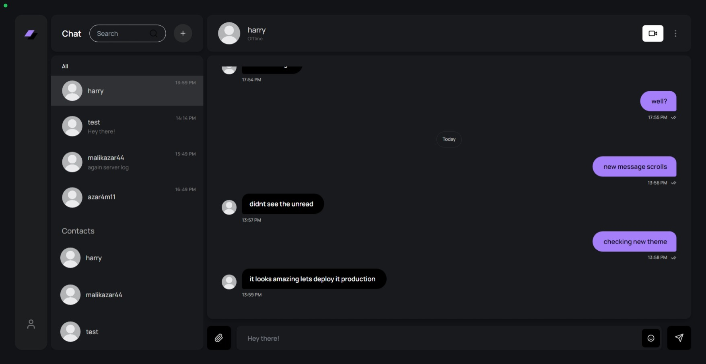

# Next.js Chat Application

This is a real-time chat application built with Next.js, Tailwind CSS, NextAuth, MongoDB, LiveKit and Socket.IO.

## Note: 
The project url may take couple of minutes, because of free tier hosting limitations

## Features

- Real-time messaging: Send and receive messages in real-time using Socket.IO.
- Add Users: add other users with their login email 
- User authentication: Securely register and log in users using MongoDB and NextAuth.
- Video chat: Talk face-to-face with other users.
- One-on-one Talk: Chat directly with your friends privately.
- Send Images and Emojis: Able to send images and emojis.

## Built With

- [Next.js](https://nextjs.org/)
- [TailwindCSS](https://tailwindcss.com/)
- [NextAuth](https://next-auth.js.org/)
- [MongoDB](https://mongodb.com)
- [SocketIO](https://socket.io/)
- [LiveKit](https://livekit.io/)

## Getting Started

These instructions will get you a copy of the project up and running on your local machine for development and testing purposes.

### Installation

1. Clone the repository: `git clone https://github.com/azr-arch/realtime-chat-app.git`
2. Install the dependencies: `npm install`
3. Start the development server: `npm run dev`

## License

This project is licensed under the MIT License - see the [LICENSE.md] file for details

---

**Design Credit**: The design for this project is inspired by [https://dribbble.com/shots/22529373-Desktop-design-of-a-chat-application-Lazarev]. All credit for the design goes to them.
Certainly! To add a note in your previous chat app's README about the enhanced version that follows Next.js best practices and structure, you can include something like this:

---

## Note: Enhanced Version Available!

🚀 **Check out the new and improved version of this chat app!** We've rebuilt it from scratch using Next.js, TypeScript, and other modern tools. No more React.js confusion! 🎉

[Chat App v2](https://github.com/azr-arch/chat-app-v2)

---
